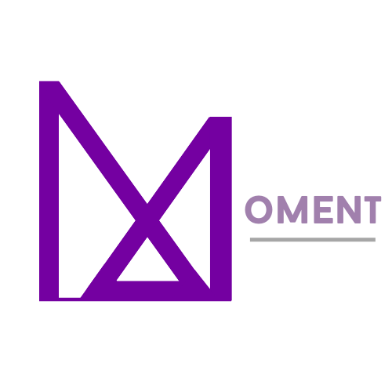

# Moment

<div align="center">


  [](http://192.144.230.76:9000/docs/)


> Capture every beautiful MOMENT in life

Moment 是一个与框架低耦合的、多功能的多平台聊天机器人。[使用文档](http://192.144.230.76:9000/docs/)

</div>

## 注意

该项目仍在开发中，功能与 api 可能会发生变动且可能存在一些测试未发现的 bug。

## 支持的对接平台

| 框架                                                         | 聊天平台    | 备注                                                         |
| ------------------------------------------------------------ | ----------- | ------------------------------------------------------------ |
| -                                                            | Linux Shell | 即通过 shell 与 Moment 交互，聊天规则见文档。                |
| [GraiaApplication](https://github.com/GraiaProject/Application) | QQ          | Graia 系框架的 v4。目前已停止维护，但仍然可用。基于 [mirai-api-http](https://github.com/project-mirai/mirai-api-http)。 |
| [aiocqhttp](https://github.com/nonebot/aiocqhttp)            | QQ          | [nonebot](https://github.com/nonebot/nonebot) 的内部SDK，基于 [go-cqhttp](https://github.com/Mrs4s/go-cqhttp)。 |


## 特点

- 轻量易部署。Moment 在开发过程中努力做到将依赖降到最低，最大可能消除各种包的版本管理问题。

- 与框架低耦合。Moment 的设计理念就是为了能够方便对接各个聊天平台，因此它在设计上将框架（被 FrontEnd，也即前端部分处理）功能（统一称作 Plugin）分离。迁移平台时，只需要写好对应的 FrontEnd 即可轻松对接。

  >  为了与框架独立开来，Moment 自己有一套关于聊天消息（Message）和聊天图片（Picture）的设计。前端部分即负责处理好框架的消息与 Moment 的消息类型的互相转换。

- 优雅的插件式功能管理设计。对于每个功能，Moment 将其抽象为一个插件（Plugin）并统一进行管理，期间支持简单的依赖分析等。插件的抽象简洁明了，便于进行进一步功能的拓展。

- 强大的数据库插件 Database. 像操作 SQL 语言一样在你的群聊里用简单的命令控制数据！

  例如：将所有 `key` 字段为 `test1` 的条目的 `cm` 字段变为 `test2` .

  ```
  [key=test1] cm=test2
  ```

  刪掉所有数据：

  ```
  [] del
  ```

  **PS: 由于命令过于灵活，容易大幅改变原数据库，为避免误操作采用了 commit & backup 设计: 修改需要 commit 才能存回，以及随时进行备份。**

## 部署 Moment

- Step 1：配置好前端框架。一般的框架都会有成熟的配置教程。

- Step 2：将模板配置文件（`template.yml`）中相关信息改成自己机器人账户的信息。

- Step 3：启动。（其它部分的配置写在代码中，一般没必要改，有能力者可以自行改动）

  启动时需要指定配置文件路径。如果你直接在 `template.yml` 上修改，那么只需要

  ```
  python3 run.py template.yml
  ```

  

PS: 改动其它地方的配置要注意相应的文件路径位置。一般来说，出现报错只要对着错误信息修复就好，因为 Moment 是低依赖的，很少会因为框架的版本发生奇怪的错误。

## Plugins

目前 Moment 拥有 16 个插件，即 16 个不同的功能。在使用时可以用命令

```
help
```

来查看所有插件以及其运行情况。

插件功能简述如下：

- Help: 帮助文档与插件管理. 获取每个插件的帮助文档以及随时禁用/解禁他们。
- Database: 强大的信息数据库. 储存聊天消息以备以后使用.
- Random: 随机数工具. 各种和随机有关的小工具.
- Touhou: 抽车万人工具. 根据 thbwiki 的资料随机返回东方 Project 的角色、符卡。
- Translate: 翻译器. 使用 googletrans 库进行翻译.
- Hello: 开机问候与报时.
- Alarm: 闹钟插件. 设置闹钟，到时间提醒. (依赖 Database 插件)
- Word: 背单词插件. 随机从单词表中抽出单词并发送.
- Autotalk: 全自动发病. 每个随机的一小段时间自发发送消息. (依赖 Database 插件)
- Pixiv: P站图片搬运.
- PS: 云图片处理插件. 基于 Pillow 的简单图片处理.
- Judge: 锐评插件. 开启时对图片作随机回复. (依赖 Database 插件)
- Replier: 强大的键值对回复器. 功能多样, 匹配灵活. (依赖 Database 插件)
- Browser: 浏览器插件. 给予目标网址一个访问截图.
- Star: 精选评论展示插件. (依赖 Database 和 Browser 插件)
- SJTUDoor: SJTU寝室开门插件. 对机器人说句话让它开宿舍门. 


## Thanks

感谢这些项目，没有它们就没有 Moment。

- [mirai](https://github.com/mamoe/mirai) 高效率 QQ 机器人支持库
- [mirai-api-http](https://github.com/project-mirai/mirai-api-http)  Mirai HTTP API (console) plugin
- [GraiaApplication](https://github.com/GraiaProject/Application)  基于 mirai-api-http 的 Python 框架
- [ABot-Graia](https://github.com/djkcyl/ABot-Graia)  借用了 Pixiv 的 api 
- [jLock](https://github.com/cmd2001/jLock)  用于编写 SJTUDoor 插件
- [aiocqhttp](https://github.com/nonebot/aiocqhttp)  A Python SDK with async I/O for CQHTTP (OneBot).
- [go-cqhttp](https://github.com/Mrs4s/go-cqhttp)  cqhttp的golang实现，轻量、原生跨平台.


## LICENSE

本项目采用 AGPL-3.0 license.


